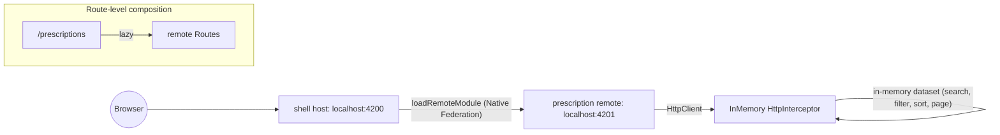

# Implementation plan — Native Federation shell + prescription remote

This plan implements the task described in [SPEC.md](SPEC.md) under the constraints recorded in [ACCEPTANCE_CRITERIA.md](ACCEPTANCE_CRITERIA.md). The existing `sample` project is **not** modified; it is used purely as a structural reference for conventions (standalone components, `ChangeDetectionStrategy.OnPush`, `inject()`, signals, feature folder layout).

Each numbered step below is intended to be a single, reviewable commit. Implementation pauses after each step for human review and a manual commit before continuing.

---

## Decisions baked into this plan

- **Federation mechanism**: `@angular-architects/native-federation`, so both apps stay on the standard `@angular/build:application` builder used by `sample`. Aligned with [ACCEPTANCE_CRITERIA.md](ACCEPTANCE_CRITERIA.md).
- **Mock backend**: an in-Angular functional `HttpInterceptor` returning in-memory data with simulated latency. No extra processes, no extra dev dependency.
- **Shared contracts**: none. The `prescription` remote owns its types; the `shell` remains a thin host and never imports remote TypeScript types. Composition happens at the runtime/route boundary only.
- **UI scope**: minimal SCSS, no UI library. Polish is intentionally thin per SPEC.
- **Auth**: out of scope per SPEC.
- **`sample`**: untouched, reference-only.

---

## High-level architecture



### Project layout (after the plan is complete)

```
projects/
  sample/                  (untouched — structural reference)
  shell/                   NEW — host, global layout/nav, federation manifest
  prescription/            NEW — single-view remote, exposes its routes
  @scope/schematics/       (untouched)
```

### Conventions inherited from `sample`

- Standalone components, `ChangeDetectionStrategy.OnPush`, `inject()`.
- Signals for local state, `computed()` for derived state.
- Reactive forms for search/filter inputs.
- Feature-folder layout: `src/app/<feature>/{containers,components,services,models,...}`.
- `app.routes.ts` per feature, lazy-loaded by the application's root `app.routes.ts`.
- SCSS, no UI library.

### Ports

- `shell` host: `http://localhost:4200`
- `prescription` remote: `http://localhost:4201` (its `remoteEntry.json` is consumed by the shell at runtime)

### Mock backend contract (lives entirely inside the remote)

Single endpoint `GET /api/prescriptions` with query params:

- `q` — free-text search across medication and insurant name
- `medication`, `insurantId` — exact-match filters
- `page` (1-based), `pageSize`
- `sort` — e.g. `prescriptionDate:desc`

Response shape:

```ts
interface PrescriptionPage {
  items: Prescription[];
  total: number;
  page: number;
  pageSize: number;
}

interface Prescription {
  id: string;
  medicationName: string;
  insurantName: string;
  insurantBirthDate: string; // ISO date
  insurantId: string;
  prescriptionDate: string;  // ISO date
}
```

The interceptor only matches requests starting with `/api/prescriptions`, simulates ~150–250 ms latency, runs against ~150 seeded records, and performs search/filter/sort/paginate in memory.

---

## Step-by-step delivery

> **Workflow**: implementation stops after every numbered step. The human reviews and manually creates the commit. Approval is required before moving to the next step.

### Step 0 — Author this PLAN.md

- Create `PLAN.md` at the repo root (this file).
- No source/config changes.

### Step 1 — Workspace prep & dependencies

- Add `@angular-architects/native-federation` as a `devDependency` in the root `package.json`.
- Add convenience npm scripts: `start:shell`, `start:prescription`, `build:shell`, `build:prescription`.
- No source files yet — pure config/dependency commit.

### Step 2 — Scaffold `shell` host project

- Run `ng generate application shell --routing --style=scss --skip-tests=false --inline-style=false --inline-template=false`.
- Reorganize generated files to mirror `sample`: move root component into `src/app/app/containers/app/`, add an `app.routes.ts`, leave `components/`, `services/`, `models/` placeholders to match the reference layout.
- Configure `angular.json` `serve` target with `port: 4200`.
- Add a minimal global layout container with header/nav and `<router-outlet>` (selector prefix `shl`).
- Verify `ng build shell` and `ng serve shell` work standalone (no federation yet).

### Step 3 — Scaffold `prescription` remote project

- Run `ng generate application prescription --routing --style=scss --skip-tests=false --inline-style=false --inline-template=false`.
- Mirror `sample` structure with a `prescription` feature folder under `src/app/prescription/{containers,components,services,models,interceptors,mocks}`.
- Configure `angular.json` `serve` target with `port: 4201`.
- Selector prefix `prx`. Stub `prescription.routes.ts` returning a placeholder container so the app boots standalone.
- Verify `ng build prescription` and `ng serve prescription` work standalone.

### Step 4 — Wire Native Federation on both apps

- Run `ng add @angular-architects/native-federation --project shell --type dynamic-host` and `--project prescription --type remote`.
- Validate the schematic produced:
  - `projects/shell/federation.config.js`, `projects/shell/src/bootstrap.ts`, `projects/shell/public/federation.manifest.json`.
  - `projects/prescription/federation.config.js`, `projects/prescription/src/bootstrap.ts`.
  - `main.ts` indirection that calls `initFederation()` then `import('./bootstrap')`.
- Edit `projects/prescription/federation.config.js` to expose `./Routes -> ./src/app/prescription/prescription.routes.ts`.
- Edit `projects/shell/public/federation.manifest.json` so the `prescription` entry points at `http://localhost:4201/remoteEntry.json`.
- Add a route in the shell:

```ts
{
  path: 'prescriptions',
  loadChildren: () =>
    loadRemoteModule({ remoteName: 'prescription', exposedModule: './Routes' })
      .then((m) => m.routes),
}
```

- Smoke test: serve both apps; navigate from shell to `/prescriptions`; the remote placeholder renders inside the shell layout.

### Step 5 — Build the prescription feature (UI + state)

- Models: `prescription.model.ts`, `prescription-query.model.ts`, `prescription-page.model.ts` under `src/app/prescription/models/`.
- `PrescriptionService` (`providedIn: 'root'`) with `inject(HttpClient)` and a single `search(query): Observable<PrescriptionPage>`.
- `PrescriptionListContainer` — owns signals for query state, computed `loading`/`error`, ReactiveForm for search/filters, pagination controls. Uses `toSignal()` over service results.
- Presentational components:
  - `PrescriptionTableComponent` — columns: Medication name, Insurant name, Insurant birth date, Insurant id, Prescription date; sortable headers via `@Output()` events.
  - `PrescriptionPagerComponent` — page index, page size, total.
- Wire `prescription.routes.ts` to load the container at the empty path so the shell mounts it at `/prescriptions`.

### Step 6 — In-memory HTTP mock

- `projects/prescription/src/app/prescription/mocks/prescriptions.seed.ts` — ~150 plausible records.
- `projects/prescription/src/app/prescription/interceptors/prescription-mock.interceptor.ts` — functional `HttpInterceptorFn` matching only `/api/prescriptions`. Performs `q` search, field filters, sort, and page slice with simulated latency. Returns `HttpResponse<PrescriptionPage>`.
- Register via `provideHttpClient(withInterceptors([prescriptionMockInterceptor]))` inside the **remote's** `app.config.ts` so the mock travels with the remote — the shell stays unaware.
- Acceptance: opening `/prescriptions` from the shell shows real paging/search/filter behavior backed entirely by in-memory data.

### Step 7 — Tests

- Unit tests:
  - `prescription.service.spec.ts` — `HttpTestingController` to assert query-string composition.
  - `prescription-mock.interceptor.spec.ts` — search, filter, sort, paging, total counts.
  - Snapshot/template test for `PrescriptionTableComponent`.
- Integration test in the shell: a Vitest test that imports the shell `routes` and asserts the `/prescriptions` route is configured to call `loadRemoteModule` with `remoteName: 'prescription'` (no actual network).
- Document e2e strategy in README (Playwright per app + a thin shell↔remote contract test) without implementing e2e in this delivery to respect the time-box.

### Step 8 — README and architectural notes

- Update root `README.md` with:
  - One-paragraph architecture summary + the mermaid diagram from this plan.
  - How to run independently: `npm run start:shell`, `npm run start:prescription`, default ports, what `remoteEntry.json` is.
  - Federation choice (Native Federation) and trade-offs vs classic Module Federation, citing [ACCEPTANCE_CRITERIA.md](ACCEPTANCE_CRITERIA.md).
  - Boundaries: shell owns layout/nav/manifest; remote owns its feature, types, and mock data; no shared library.
  - Mock backend contract and rationale for an in-Angular interceptor.
  - Testing strategy (unit, integration, e2e) and how the remote is testable in isolation.
  - Incremental migration narrative: extract a leaf feature first (read-only, low cross-cutting deps) → publish as remote → flip the host route from local `loadChildren` to `loadRemoteModule` behind a feature flag → repeat per team.
  - Brief "AI tooling usage" note as required by SPEC.
- Keep `ACCEPTANCE_CRITERIA.md` and `SPEC.md` untouched.

---

## Risks / explicit assumptions

- The Native Federation `ng add` schematic is assumed to support Angular 21. If it lags, fall back to manual config (still on `@angular/build:application`).
- Shared deps policy follows whatever `ng add` generates by default for `@angular/core`, `@angular/common`, `@angular/router`, `rxjs`. No hand-tuning of sharing in this exercise; called out as a follow-up.
- No auth, minimal styling, no real backend — all per SPEC.
- `sample` is intentionally not federated; it remains the structural reference.

---

## Progress checklist

- [x] Step 0 — Author `PLAN.md`
- [x] Step 1 — Workspace prep & dependencies
- [x] Step 2 — Scaffold `shell` host project
- [x] Step 3 — Scaffold `prescription` remote project
- [x] Step 4 — Wire Native Federation on both apps
- [x] Step 5 — Build the prescription feature (UI + state)
- [x] Step 6 — In-memory HTTP mock
- [x] Step 7 — Tests
- [ ] Step 8 — README and architectural notes
