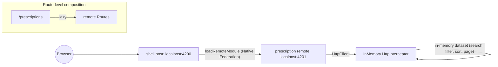

# Solution summary

This document is the long-form architectural and implementation summary for the challenge described in [SPEC.md](SPEC.md), under the constraints recorded in [ACCEPTANCE_CRITERIA.md](ACCEPTANCE_CRITERIA.md), implemented step-by-step per [PLAN.md](PLAN.md). The repository's [README.md](README.md) is intentionally short and links here for the depth.

The primary `sample` project (`projects/sample/`) is **not** modified; it is used purely as a structural reference for conventions (standalone components, `ChangeDetectionStrategy.OnPush`, `inject()`, signals, feature folder layout).

---

## What was built

Two Angular 21 applications, **independently buildable and runnable**, composed at runtime through Angular Architects' Native Federation:

- **`shell`** — host application providing global layout/header/navigation and a federation manifest.
- **`prescription`** — remote application that owns one feature: a single `/` view containing a server-driven prescriptions table with search, filters, sorting, and paging.

The remote ships its own in-memory mock backend (HTTP interceptor, ~150-record seed) so the demo runs end-to-end with zero infrastructure. The shell never imports anything from the remote at build time.



---

## Repository layout

```
projects/
  sample/                  (untouched - structural reference only)
  shell/                   host, global layout/nav, federation manifest
    federation.config.js
    public/
      federation.manifest.json
    src/
      bootstrap.ts
      main.ts                          (initFederation -> import('./bootstrap'))
      app/
        app/
          app.config.ts
          app.routes.ts                (/home + /prescriptions via loadRemoteModule)
          components/header/
          containers/app/
        home/                          (lazy-loaded local welcome page)
  prescription/            remote, single prescriptions view
    federation.config.js               (exposes './Routes')
    src/
      bootstrap.ts
      main.ts                          (initFederation() -> import('./bootstrap'))
      app/
        app/
          app.config.ts                (no provideHttpClient at root by design)
          app.routes.ts
        prescription/                  (the only feature)
          prescription.routes.ts       (route-scoped HttpClient + interceptor + service)
          containers/prescription-list/
          components/prescription-table/
          components/prescription-pager/
          services/prescription.service.ts
          interceptors/prescription-mock.interceptor.ts
          mocks/prescriptions.seed.ts
          models/
  @scope/schematics/       (untouched)
```

---

## Why Native Federation is the chosen runtime

Per [ACCEPTANCE_CRITERIA.md](ACCEPTANCE_CRITERIA.md), the federation mechanism is **`@angular-architects/native-federation`** — the deliberate, primary choice, not a fallback or compromise. It is the federation runtime that fits cleanly inside the Angular CLI's default `@angular/build:application` (esbuild) pipeline, and it implements the same federation contract classic Module Federation popularized: singleton-aware shared dependencies, semver-based version negotiation, runtime composition, and a manifest-driven preload graph. The full reasoning lives in [`ACCEPTANCE_CRITERIA.md`](ACCEPTANCE_CRITERIA.md) (informed by the [Zephyr Cloud "Module Federation vs Native ESM"](https://zephyr-cloud.io/blog/module-federation-vs-native-esm) article); the short version:

- **Native Federation implements the federation contract on top of ESM/import-map transport.** Singleton enforcement (`shareAll({ singleton: true, strictVersion: true })`), semver negotiation, dynamic `loadRemoteModule(...)`, and a `remoteEntry.json` + `importmap.json` manifest pair the host uses to fetch shared chunks in parallel — the same federation primitives a classic Webpack/Rspack runtime exposes, just produced as standards-aligned ESM artefacts.
- **Pure ESM + import maps without a federation runtime is not a viable substitute** at this scope. Standards solve the *loading* problem; they do not solve singleton enforcement, semver negotiation, dynamic registration, or coordinated error recovery. For a micro-frontend topology that crosses team boundaries, the management layer is what makes the runtime survive contact with reality.
- **Classic Webpack/Rspack Module Federation is the right call only when a team needs bundler-runtime capabilities not yet exposed by Native Federation** (programmatic remote unload, layered singletons across breaking major versions, the wider loader-hook ecosystem) **and** is prepared to take ownership of a non-default bundler stack. None of those constraints apply to this challenge — single Angular 21 monorepo, single major version, single remote, no long-lived multi-tab shell. Reaching for classic MF here would import operational risk for capabilities the demo would not exercise.

The exposed `remoteEntry.json` and `importmap.json` artifacts (visible in `dist/prescription/browser/`) make the manifest layer concrete; the host requests shared chunks from the remote in parallel rather than via a depth-driven import waterfall. If a future product need ever requires the wider classic-MF runtime surface, the documented [combining-Native-and-Module-Federation pattern](https://www.angulararchitects.io/en/blog/combining-native-federation-and-module-federation/) keeps it reachable from the architecture chosen here.

---

## Boundaries between shell and remote

Strict, runtime-only:

- **Shell** owns:
  - Global layout (header, brand, primary nav, `<router-outlet>`).
  - The `federation.manifest.json` listing remotes the host knows about.
  - Top-level routes; `/prescriptions` lazy-loads the federated remote via `loadRemoteModule({ remoteName: 'prescription', exposedModule: './Routes' })`.
  - Nothing else. The shell's `app.config.ts` does **not** provide `HttpClient`. The shell does **not** import any TypeScript type from the prescription project.

- **Prescription remote** owns:
  - Its single feature (table + search + paging + sort).
  - Its data layer (`PrescriptionService`, models).
  - Its mock backend (`prescription-mock.interceptor.ts`, `prescriptions.seed.ts`).
  - The `HttpClient` instance the feature uses, scoped to its own route subtree.
  - Its own bootstrap and `app.config.ts` so it remains runnable standalone at `:4201`.

This is route-level composition, not framework- or module-level coupling. The shell could have zero or many remotes; switching one in or out is a manifest edit + a `loadRemoteModule` route entry, with no shell-side code import changes.

---

## Mock backend contract (lives entirely inside the remote)

Single endpoint:

```
GET /api/prescriptions
```

Query parameters:

| Param        | Type   | Notes                                                                                  |
| ------------ | ------ | -------------------------------------------------------------------------------------- |
| `q`          | string | Free-text, case-insensitive substring match across `medicationName` and `insurantName` |
| `medication` | string | Exact match on `medicationName`                                                        |
| `insurantId` | string | Exact match on `insurantId`                                                            |
| `page`       | int    | 1-based, defaults to `1`, fallback on invalid                                          |
| `pageSize`   | int    | defaults to `10`, fallback on invalid                                                  |
| `sort`       | string | `field:direction`, e.g. `prescriptionDate:desc`. Invalid sort strings are ignored      |

Sortable fields: `medicationName`, `insurantName`, `insurantBirthDate`, `insurantId`, `prescriptionDate`.

Response shape:

```ts
interface PrescriptionPage {
  items: ReadonlyArray<Prescription>;
  total: number;
  page: number;
  pageSize: number;
}

interface Prescription {
  id: string;                  // RX-00001 ... RX-00150
  medicationName: string;
  insurantName: string;
  insurantBirthDate: string;   // ISO date
  insurantId: string;          // A100000000 ... A101000043
  prescriptionDate: string;    // ISO date
}
```

The interceptor only matches requests starting with `/api/prescriptions`; anything else falls through to `next(req)` so it cannot interfere with federation manifest fetches or any other HTTP traffic. Latency is simulated at 150–250 ms per call. The seed dataset is 150 records, deterministic, built from small base lists (15 medications, 15 first names, 15 last names).

### Why the mock is a route-scoped HttpInterceptor instead of `providedIn: 'root'`

This was the most consequential architectural choice in the implementation. See it captured in `prescription.routes.ts`:

```7:19:projects/prescription/src/app/prescription/prescription.routes.ts
export const routes: Routes = [
  {
    path: '',
    providers: [
      provideHttpClient(withInterceptors([prescriptionMockInterceptor])),
      PrescriptionService,
    ],
    loadComponent: () =>
      import('./containers/prescription-list/prescription-list.component').then(
        (m) => m.PrescriptionListComponent,
      ),
  },
];
```

If `PrescriptionService` had stayed `providedIn: 'root'`, then `inject(HttpClient)` inside it would resolve from the **shell's** root injector when running federated — and the shell intentionally has no `HttpClient` and no knowledge of the mock. Moving `HttpClient` + interceptor + service into `Route.providers` makes the mock work identically in both modes:

- **Standalone** (`http://localhost:4201/`): the empty-path route activates with the mock-equipped HttpClient.
- **Federated** (`http://localhost:4200/prescriptions`): the shell loads `./Routes` via `loadRemoteModule`; the same `Route.providers` apply when the route activates inside the host.

The shell stays unaware of HTTP and remote types. The interceptor's scope is strictly the prescription subtree, preventing accidental interception elsewhere in a multi-remote shell down the road.

---

## How to run

Two independent Angular projects. From the repository root:

```bash
npm install

# Run them in two separate terminals — order matters: start the remote first
# so its remoteEntry.json is reachable when the shell composes /prescriptions.
npm run start:prescription      # http://localhost:4201
npm run start:shell             # http://localhost:4200
```

What you should see:

- `http://localhost:4200/` — shell home page, no remote required.
- `http://localhost:4200/prescriptions` — shell layout with the federated prescription view rendering inside; dev tools network tab shows `http://localhost:4201/remoteEntry.json` being fetched, then shared chunks, then `Routes.js`.
- `http://localhost:4201/` — prescription remote running standalone; same view, no shell layout. Useful for isolated development of the remote.

Build artifacts (used as evidence of the wiring in [PLAN.md](PLAN.md) Step 4):

- `dist/prescription/browser/remoteEntry.json` — exposes `./Routes` and lists shared `@angular/*`, `rxjs`, `tslib` with `singleton: true, strictVersion: true`.
- `dist/prescription/browser/importmap.json` — runtime import map mapping shared specifiers to versioned filenames.
- `dist/shell/browser/federation.manifest.json` — `{ "prescription": "http://localhost:4201/remoteEntry.json" }`.

Other commands:

```bash
npm run build:shell             # production build of the shell
npm run build:prescription      # production build of the remote
npm test                        # all Vitest specs (10 files / 37 specs at the time of writing)
npm run test:file -- <path>     # focused Vitest run
```

Ports are pinned in `angular.json` (`shell.architect.serve-original.options.port = 4200`, `prescription.architect.serve-original.options.port = 4201`). The Native Federation builder wraps these targets and adds the federation artifact build step ahead of the standard `@angular/build:application` invocation.

---

## Testing strategy

The repository ships **10 spec files / 37 specs** across the two apps. The split is intentional:

- **`PrescriptionService` specs** (`prescription.service.spec.ts`) verify the **HTTP contract** — query string composition, GET method, optional-param omission, response pass-through — against `HttpTestingController`. This is the cross-team interface a real backend would have to honor.
- **`prescriptionMockInterceptor` specs** (`prescription-mock.interceptor.spec.ts`) verify the **mock backend semantics** — paging (defaults, end-of-data, fallback), search/filter (free-text and exact match), sort (direction toggling, invalid sort tolerated). With a real backend this would belong to the backend team's test suite; here it's the only place those guarantees are pinned, so it acts as a contract test for the mock.
- **`PrescriptionTableComponent` specs** verify the **template contract** — five required column headers in order, row rendering, empty state, `aria-sort` semantics, and the full `null → asc → desc → null` sort cycle.
- **`PrescriptionPagerComponent` specs** verify the summary text, disabled-button states on first/last page, and `pageChange` / `pageSizeChange` emissions.
- **`shell` route integration spec** (`projects/shell/src/app/app/app.routes.spec.ts`) verifies the **federation wiring shape** without performing any network call — it inspects the function source of `routes['prescriptions'].loadChildren` to assert it calls `loadRemoteModule` with `remoteName: 'prescription'` and `exposedModule: './Routes'`. Quote-style is matched via a regex so the test stays robust against TypeScript output choices.

Layered like that, each layer can fail independently and points at exactly one place.

### What is **not** covered, on purpose

- **End-to-end (Playwright) tests** are out of scope per the SPEC's time-box. The plan would be:
  - **Per-app Playwright runs**: shell and prescription each run their happy paths in isolation against `ng serve`. Prescription's Playwright test would even cover real search/filter/page interactions because the mock interceptor lives in-app.
  - **Shell↔remote contract tests**: a small Playwright job that boots **both** dev servers, loads `http://localhost:4200/prescriptions`, asserts at least one row from the seed renders, and that the request to `/remoteEntry.json` returned 200. This is the cheapest way to catch federation regressions (manifest shape, exposed module name, import map drift).
  - **Visual snapshot of the home + prescriptions pages**: optional, helps catch accidental changes to global layout.
- **Resource-based container tests** for `PrescriptionListComponent` are deferred. The component uses Angular 21's `resource({ params, loader })`; deterministic transition assertions need fake timers + `vi.runAllTimersAsync()` and add boilerplate. The behaviors it would cover are already split between the service spec, interceptor spec, and table/pager specs.

---

## Incremental migration narrative (for the interview)

This stack is designed to support a phased extraction from a hypothetical Angular monolith toward a federated topology, with the lowest possible disruption to ongoing development:

1. **Pick a leaf feature first.** Read-only or low-write features with shallow cross-cutting dependencies (no global state coupling, no shared services beyond HTTP) are extracted first. The "prescriptions" view in this repo is exactly that profile — a search/list view without write paths or complex inter-feature dependencies.
2. **Vendor the feature into a new Angular CLI project.** Same monorepo (or a new one). Keep its conventions identical to the host monolith so engineers moving between them feel no friction. In this repo, that conformance is enforced by the workspace `.cursor/rules/angular/` and by mirroring `sample`'s feature folder layout.
3. **Wrap it as a Native Federation remote.** `ng add @angular-architects/native-federation --type remote` (or, when the schematic is uncooperative as it was here, write `federation.config.js` + `bootstrap.ts` + the `main.ts` indirection by hand using the host's output as a reference).
4. **Add a feature flag in the monolith's router.** Behind the flag, `loadChildren: () => import('./feature/...')` (local, today). With the flag on, `loadChildren: () => loadRemoteModule(...).then(m => m.routes)` (federated, after rollout). Same route, same URL, same UX. The flag is the kill switch.
5. **Move the data layer into the remote with route-scoped DI.** Same pattern shown in `prescription.routes.ts` here: `Route.providers: [PrescriptionService, provideHttpClient(...)]`. The host loses an `HttpClient` provider for that subtree; the remote brings its own, including any feature-specific interceptors (auth, telemetry, error mapping, mock backends in dev). This is the single most important step for keeping the host injector clean during migration.
6. **Repeat per team.** Each new remote follows the same template. Cross-cutting concerns that *do* belong globally (auth tokens, design system, telemetry SDK) stay in the shell or move to a small shared library; everything else is owned by the remote that owns the feature.

What this avoids:

- **No big-bang refactor.** The monolith keeps shipping; remote takeovers are switch flips.
- **No coordinated release across teams.** Once the route is federated, the remote ships independently of the host.
- **No widening of the host's injector.** Route-scoped DI is the standing rule, not a special case.

What this does **not** avoid (constraints inherent to federated micro-frontends, not specific to Native Federation):

- The **DX cost of cross-origin debugging** (separate source maps, multi-origin DevTools) becomes real once remotes ship from different domains. A unified delivery layer mitigates it; the [Zephyr Cloud article](https://zephyr-cloud.io/blog/module-federation-vs-native-esm) calls this out as the primary developer-productivity gap of federation, and the platform exists to address it.
- **Memory recovery in long-lived multi-remote shells.** ESM lacks unload semantics, so any federation runtime layered on it inherits this. For multi-tab admin consoles that need programmatic memory recovery, the documented [combining-Native-and-Module-Federation pattern](https://www.angulararchitects.io/en/blog/combining-native-federation-and-module-federation/) reaches the broader MF runtime APIs (`registerRemotes(..., { force: true })`, `removeRemote()`); not relevant for the single-remote demo here.
- **Layered singletons** (e.g. side-by-side Angular major versions during a brownfield consolidation). The same combination pattern, or an iframe boundary, is the practical answer when migration straddles a breaking Angular major. Out of scope for a single-major-version monorepo.

---

## Trade-offs and known limitations specific to this repo

- **`ng add @angular-architects/native-federation --type remote` hung silently** during Step 4 of the plan. The shell schematic (`--type dynamic-host`) ran cleanly. For the remote we wrote `federation.config.js`, `src/bootstrap.ts`, and the `src/main.ts` indirection by hand using the shell's schematic output as the canonical template, plus the `angular.json` block (NF wrapping the existing `@angular/build:application` build under an `esbuild` target, plus the matching `serve-original` target). The result is byte-for-byte equivalent to what the schematic would have produced.
- **`@angular-devkit/build-angular` and `@angular/animations`** were added by the NF schematic to `package.json`. Both were removed: the former because we ride on `@angular/build:application` (the new application builder), and the latter because neither app uses Angular animations and keeping it caused a peer-dep conflict against the project's pinned Angular versions.
- **Production budgets** were not relaxed. Both apps build cleanly under the default 500 KB/1 MB initial budgets in development; if production federation polyfills push us past 500 KB, the right move is to shave shared deps via `skip` in `federation.config.js` rather than blindly raising the budget.
- **Single search input.** The query model supports `medication` and `insurantId` exact-match filters, but the UI exposes only the free-text `q` input. Per the SPEC, table-level UI is intentionally minimal; the back-end contract is the broader surface.
- **No ESM unload.** As discussed above, the prescription remote stays loaded for the lifetime of the shell page. Acceptable for a single-remote demo; documented as future work for a multi-tab admin shell.
- **Single remote in the manifest.** The federation manifest only references `prescription`. The shell schematic auto-added a stray `sample` entry (because `sample` is an application in the workspace); we removed it to keep the manifest accurate.
- **CORS in production.** Dev works because Angular's dev server returns permissive CORS headers. Any non-dev deployment must explicitly set CORS headers on the remote's static origin and budget for the cross-origin DX cost discussed above.

---

## Use of AI tooling (per SPEC)

The implementation was carried out in pair-programming style with Cursor's Claude Opus 4.7 agent operating under explicit, step-by-step approval and human-driven commits. Concretely:

- **Planning and decomposition.** The eight-step plan in [PLAN.md](PLAN.md) was drafted by the AI in Plan mode, refined by two clarifying questions to the human (mock backend strategy, shared-contracts strategy), and approved before any code was written.
- **Architectural decisions** — federation choice (Native Federation), no shared-contracts library, mock as in-Angular HTTP interceptor, route-scoped DI for the mock — were proposed by the AI and ratified by the human. The most consequential choice (route-scoped HttpClient + interceptor + service) was specifically discussed in conversation when the failure mode of `providedIn: 'root'` under federation was identified.
- **Step-by-step implementation.** Every numbered step was implemented in a single agent turn, demoed via build/test output, and committed manually by the human before the next step began. This produced a linear, reviewable commit history.
- **Recovery from tooling friction.** When `ng add @angular-architects/native-federation --type remote` hung, the AI reverted to writing the equivalent files by hand using the host's schematic output as the template; when the post-install step failed on a peer-dep conflict, the AI removed the unused `@angular-devkit/build-angular` and `@angular/animations` entries to unblock the lockfile.
- **Editing of supporting documents.** This `SUMMARY.md`, the short-form `README.md`, the augmented `ACCEPTANCE_CRITERIA.md` (after the [Zephyr Cloud article](https://zephyr-cloud.io/blog/module-federation-vs-native-esm) was provided by the human), and the `PLAN.md` checklist were all authored by the AI under human review.

What was **not** AI-driven:

- The challenge brief in [SPEC.md](SPEC.md) and the framing of [ACCEPTANCE_CRITERIA.md](ACCEPTANCE_CRITERIA.md) (the "Builder and toolchain risk" framing and Native Federation as the chosen mechanism) predate this implementation session.
- The decision to keep `sample` untouched, the decision to commit per step, and final approvals were all human.
- Workspace-level `.cursor/rules/` and `AGENTS.md` predate this session and were respected as constraints, not authored.

---

## Future work

- **Production CORS + caching strategy** for the remote origin once it ships behind a real CDN.
- **Playwright e2e** as outlined in the testing section above (per-app + thin shell↔remote contract test).
- **Unified delivery layer** to address the cross-origin DX cost — Zephyr Cloud is the platform the article positions for this; in-house, a single CDN with a per-team prefix accomplishes most of the same.
- **Programmatic remote unload** for long-lived multi-remote shells — reachable today via the [combining-Native-and-Module-Federation pattern](https://www.angulararchitects.io/en/blog/combining-native-federation-and-module-federation/) or an iframe/worker boundary; only worth introducing if a real product need surfaces.
- **Federated TypeScript types** for `./Routes` — currently the shell's route uses `(m) => m.routes` with `any`-shaped contract because we deliberately avoided shipping a shared types package. A small `@scope/contracts` library or the official `@angular-architects/native-federation`-typed entry pattern would tighten this without re-introducing build-time coupling.
- **Field filters in the toolbar** (medication, insurantId) once a UX direction is set.

---

## Index of related documents

- [SPEC.md](SPEC.md) — the original challenge brief.
- [ACCEPTANCE_CRITERIA.md](ACCEPTANCE_CRITERIA.md) — chosen approach, Native Federation rationale, trade-offs, references.
- [PLAN.md](PLAN.md) — the eight-step implementation plan with progress checklist.
- [README.md](README.md) — short-form quick start; links here for depth.
